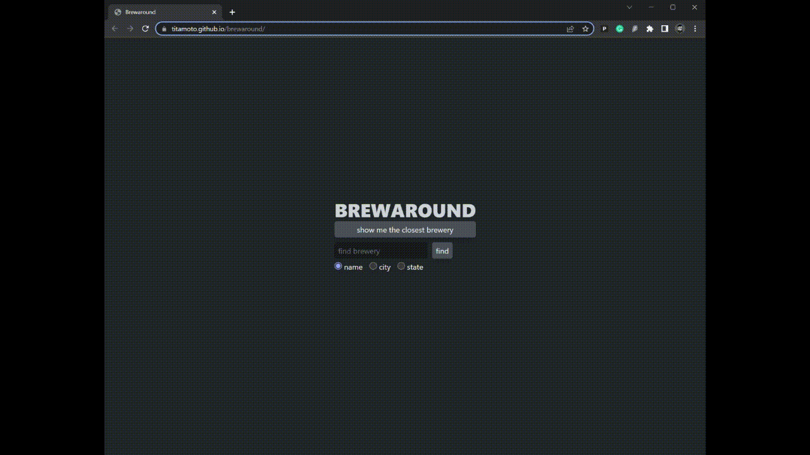
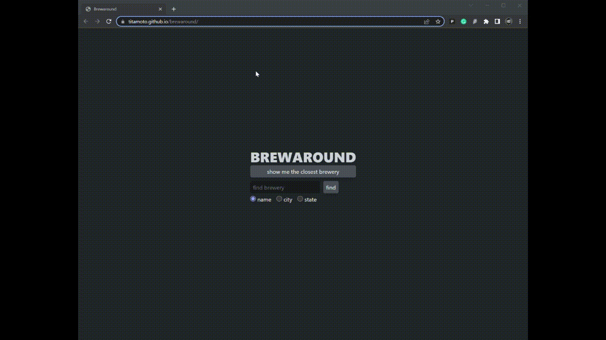

# Brewaround :beers:

[Brewaround](https://www.titamoto.github.io/brewaround) is a single-page application for searching breweries.
The app is based on [Open Brewery DB](https://www.openbrewerydb.org/) API.

## How to Use

Show closest brewery demo:

Search by brewery name demo:

Search by city demo:

Search by state demo:

## Credits

Thanks [Open Brewery DB](https://www.openbrewerydb.org/) for API and [Open Props](https://open-props.style/) for styling tools.

## License

[MIT](https://choosealicense.com/licenses/mit/)